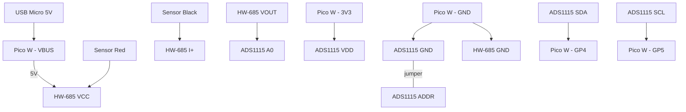

# Cistern Water Level Monitor

Remote cistern water level monitoring using a Raspberry Pi Pico W with OTA updates.

## Hardware

| Component | Purpose |
|-----------|---------|
| Pico W | Microcontroller with WiFi |
| 4-20mA depth sensor | Submersible pressure transducer |
| HW-685 | Current-to-voltage converter |
| ADS1115 | 16-bit ADC (I2C) |

## Wiring



**Pin connections:**

| From | To |
|------|-----|
| Pico VBUS (5V) | HW-685 VCC |
| Pico GND | HW-685 GND |
| Pico GND | ADS1115 GND |
| Pico 3V3 | ADS1115 VDD |
| Pico GP4 | ADS1115 SDA |
| Pico GP5 | ADS1115 SCL |
| ADS1115 ADDR | GND (0x48) |
| HW-685 VOUT | ADS1115 A0 |
| Sensor Red | HW-685 VCC |
| Sensor Black | HW-685 I+ |

## Setup

### Flashing MicroPython (Fresh or Re-flash)

**Requirements:**

```bash
brew install picotool
pip install mpremote
```

**1. Enter BOOTSEL mode:** Hold the BOOTSEL button on the Pico W while plugging it into USB.

**2. Erase the entire flash** (removes all code and filesystem):

```bash
picotool erase --all
```

**3. Download and flash MicroPython:**

Download the latest Pico W firmware from [micropython.org/download/RPI_PICO_W](https://micropython.org/download/RPI_PICO_W/), then:

```bash
picotool load RPI_PICO_W-<version>.uf2
picotool reboot
```

**4. Verify the Pico W is running MicroPython:**

```bash
mpremote connect list
```

You should see a device like `/dev/cu.usbmodem*` listed as `MicroPython Board in FS mode`.

> **Important:** Always use `picotool` for flashing — do NOT drag-and-drop `.uf2` files to `/Volumes/RPI-RP2`. macOS may report the copy as successful before the data is fully written, resulting in a corrupted or incomplete flash. The `picotool erase --all` command is also necessary to wipe the MicroPython filesystem area where user scripts (`boot.py`, `main.py`, etc.) are stored — a firmware-only flash leaves old code intact.

### Upload Cistern Code

```bash
mpremote cp boot.py main.py sensor.py ota.py firebase.py provision.py config.py.example :
```

### Provision WiFi

1. Power on the Pico — it starts a **"Cistern-Setup"** WiFi hotspot
2. Connect your phone to it (password: `cistern123`)
3. Enter the home WiFi credentials in the setup page
4. Pico saves, reboots, and starts monitoring

## Firebase

Readings are posted to Firestore every 60 seconds.

### Infrastructure

```bash
cd infrastructure
cp terraform.tfvars.example terraform.tfvars  # set your project ID
./init.sh
terraform apply
```

### Dashboard

A single-page dashboard in `dashboard/index.html` — deploy anywhere (GitHub Pages, Vercel, etc.).

1. Edit `dashboard/index.html` and set `FIREBASE_PROJECT_ID` and `FIREBASE_API_KEY`
2. Open in a browser or deploy

Shows: water level gauge, depth, voltage, 24h history chart, device telemetry.
```

## OTA Updates

The Pico checks for updates on boot by comparing `version.txt` with the remote version.

To push an update:
1. Edit code in this repo
2. Bump `version.txt`
3. Push to GitHub
4. Pico downloads new files on next boot

## Files

| File | Purpose |
|------|---------|
| `boot.py` | WiFi connection or provisioning on startup |
| `main.py` | Main loop: read sensor, post to Firebase |
| `sensor.py` | ADS1115 driver, returns raw voltage |
| `ota.py` | Over-the-air update logic |
| `firebase.py` | Post readings to Firestore |
| `provision.py` | WiFi AP provisioning (captive portal) |
| `config.py.example` | Config template (gitignored when copied) |
| `version.txt` | Current firmware version |
| `dashboard/` | Web dashboard (static HTML) |
| `infrastructure/` | Terraform for Firebase setup |

## Calibration

Calibration values are stored in Firestore at `/config/calibration` and loaded by the dashboard on page load. This means you can recalibrate without redeploying anything.

Edit `tests/seed_calibration.py` to match your sensor and tank, then run:

```bash
python3 -m tests.seed_calibration
```

| Field | Default | Description |
|-------|---------|-------------|
| `v_min` | 0.66 | Voltage at 4mA (sensor reads 0 depth) |
| `v_max` | 3.3 | Voltage at 20mA (sensor reads max depth) |
| `depth_max_m` | 5.0 | Sensor maximum depth rating in meters |
| `tank_radius_in` | 28.8 | Tank cross-section radius in inches |
| `tank_length_in` | 133.0 | Tank body length in inches |
| `tank_max_gal` | 1500 | Rated capacity in gallons |

If the config document doesn't exist, the dashboard falls back to the defaults above.

The Pico sends only raw voltage — all depth/volume computation happens client-side on the dashboard using the horizontal cylinder formula.

## License

MIT
