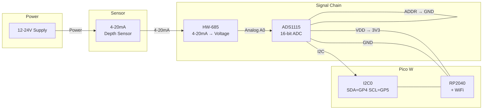

# Cistern Water Level Monitor

Remote cistern water level monitoring using a Raspberry Pi Pico W with OTA updates.

## Hardware

| Component | Purpose |
|-----------|---------|
| Pico W | Microcontroller with WiFi |
| 4-20mA depth sensor | Submersible pressure transducer |
| HW-685 | Current-to-voltage converter |
| ADS1115 | 16-bit ADC (I2C) |

## Wiring



**Pin connections:**

| ADS1115 | Pico W |
|---------|--------|
| VDD     | 3V3    |
| GND     | GND    |
| SDA     | GP4    |
| SCL     | GP5    |
| ADDR    | GND    |

## Setup

1. Flash MicroPython to your Pico W
2. Copy `config.py.example` to `config.py` and fill in your WiFi credentials
3. Upload all `.py` files to the Pico

```bash
pip install mpremote
mpremote cp boot.py main.py sensor.py ota.py config.py :
```

## OTA Updates

The Pico checks for updates on boot by comparing `version.txt` with the remote version.

To push an update:
1. Edit code in this repo
2. Bump `version.txt`
3. Push to GitHub
4. Pico downloads new files on next boot

## Files

| File | Purpose |
|------|---------|
| `boot.py` | WiFi connection on startup |
| `main.py` | Main loop |
| `sensor.py` | ADS1115 driver + depth calculation |
| `ota.py` | Over-the-air update logic |
| `config.py` | WiFi creds (gitignored) |
| `version.txt` | Current firmware version |

## Calibration

Edit `sensor.py` to match your sensor:

```python
V_MIN = 0.66      # Voltage at 4mA (empty)
V_MAX = 3.3       # Voltage at 20mA (full)
DEPTH_MAX = 5.0   # Sensor max depth in meters
```

## License

MIT
