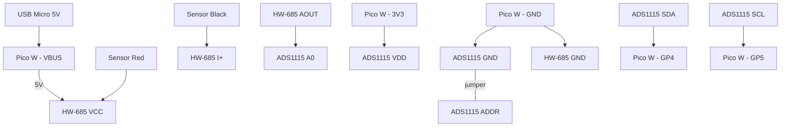

# Cistern Water Level Monitor

Remote cistern water level monitoring using a Raspberry Pi Pico W with OTA updates.

## Hardware

| Component | Purpose |
|-----------|---------|
| Pico W | Microcontroller with WiFi |
| 4-20mA depth sensor | Submersible pressure transducer |
| HW-685 | Current-to-voltage converter |
| ADS1115 | 16-bit ADC (I2C) |

## Wiring



**Pin connections:**

| From | To |
|------|-----|
| Pico VBUS (5V) | HW-685 VCC |
| Pico GND | HW-685 GND |
| Pico GND | ADS1115 GND |
| Pico 3V3 | ADS1115 VDD |
| Pico GP4 | ADS1115 SDA |
| Pico GP5 | ADS1115 SCL |
| ADS1115 ADDR | GND (0x48) |
| HW-685 AOUT | ADS1115 A0 |
| Sensor Red | HW-685 VCC |
| Sensor Black | HW-685 I+ |

## Setup

1. Flash MicroPython to your Pico W
2. Upload all `.py` files to the Pico:

```bash
pip install mpremote
mpremote cp boot.py main.py sensor.py ota.py firebase.py provision.py config.py.example :
```

3. Power on the Pico — it starts a **"Cistern-Setup"** WiFi hotspot
4. Connect your phone to it (password: `cistern123`)
5. Enter the home WiFi credentials in the setup page
6. Pico saves, reboots, and starts monitoring

## Firebase

Readings are posted to Firestore every 60 seconds.

### Infrastructure

```bash
cd infrastructure
cp terraform.tfvars.example terraform.tfvars  # set your project ID
./init.sh
terraform apply
```

### Dashboard

A single-page dashboard in `dashboard/index.html` — deploy anywhere (GitHub Pages, Vercel, etc.).

1. Edit `dashboard/index.html` and set `FIREBASE_PROJECT_ID` and `FIREBASE_API_KEY`
2. Open in a browser or deploy

Shows: water level gauge, depth, voltage, 24h history chart.
```

## OTA Updates

The Pico checks for updates on boot by comparing `version.txt` with the remote version.

To push an update:
1. Edit code in this repo
2. Bump `version.txt`
3. Push to GitHub
4. Pico downloads new files on next boot

## Files

| File | Purpose |
|------|---------|
| `boot.py` | WiFi connection or provisioning on startup |
| `main.py` | Main loop: read sensor, post to Firebase |
| `sensor.py` | ADS1115 driver + depth calculation |
| `ota.py` | Over-the-air update logic |
| `firebase.py` | Post readings to Firestore |
| `provision.py` | WiFi AP provisioning (captive portal) |
| `config.py.example` | Config template (gitignored when copied) |
| `version.txt` | Current firmware version |
| `dashboard/` | Web dashboard (static HTML) |
| `infrastructure/` | Terraform for Firebase setup |

## Calibration

Edit `sensor.py` to match your sensor:

```python
V_MIN = 0.66      # Voltage at 4mA (empty)
V_MAX = 3.3       # Voltage at 20mA (full)
DEPTH_MAX = 5.0   # Sensor max depth in meters
```

## License

MIT
